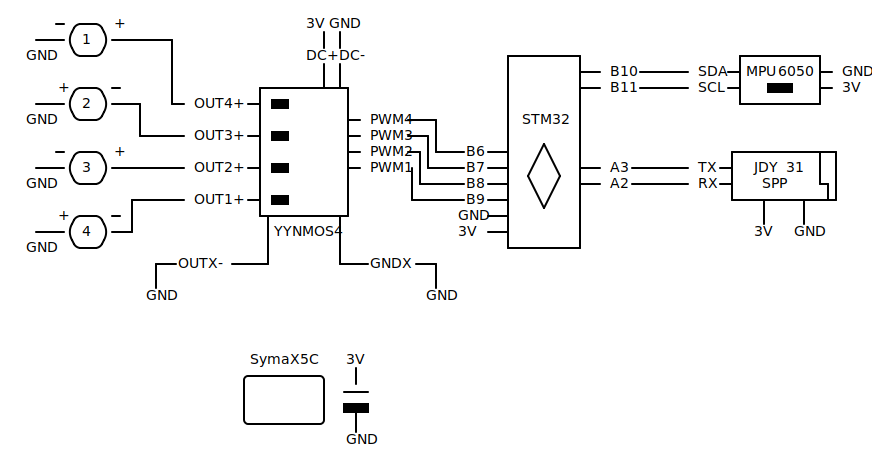

# quad

Drone in the making

# Project overview

Project is split in 3 crates as well as Godot project.

`flight-controller` targets stm32f103 boards and includes logic handling pwm signals for motor control, IMU, bluetooth communication via UART.

`client-util` targets PC and mainly provides helper functions for communication via Bluetooth with RFCOMM.

`common` is a holds shared functionality between above crates and includes types describing message format for communication between stm32 device and host.

Godot is mainly used as a tool to build interactive UI serving as mission control for the drone.

# Hardware

1. Main board - stm32f103c8
2. IMU with Gyro and Accelerometer - mpu6050
3. Telemetry and control via Bluetooth - JDY-31-SPP
4. Power delivery - YYNMOS-4 MOSFET driver
5. Battery - Syma X5C 3.7V 600mah or any other rated 25C
6. Motors - 4 x 8520 coreless motor
7. Propellers - 4 x 55mm (2 x CW + 2 x CCW), shaft diameter must match of motors
8. [Frame](resources/part.stl) - 3d printed in 4 identical pieces, might need to adjust tolerances

Total weight assembled ~ 82g

# Motors & IMU orientation

<TODO>

# Wiring diagram

Power for bluetooth module and IMU can be connected to main board directly for convenience.

`GNDX` terminals on mosfet driver can be soldered together and connected to `GND` on main board.

Important note is since motors need to spin in opposite directions, one needs to pay attention connecting motor wires to mosfet driver.

Motors polarity described as `+` and `-` and is reversed for 2nd and 4th motor.

Battery terminals are shared betewen `DC+/-` connections on mosfet driver and `3V/GND` on main board.

# Todos

- [ ] Test naive stabilisation
- [ ] Share state types between client and device libraries
- [ ] Update mission control UI to include state
- [ ] Check if Tokio or any other runtime can help to buffer telemetry on the client in separate task/thread
- [ ] Send state telemetry from device

# Potential upgrades

- IMU with mangetometer to correct for yaw drift
- IR sensor to measure distance to the ground
  - Upgrade stabilisation to implement "Hover" mode
- Swap Bluetooth for RC to increase range
- Downward facing camera to detect position drift
- Toroidal propeller to improve noise / efficiency?